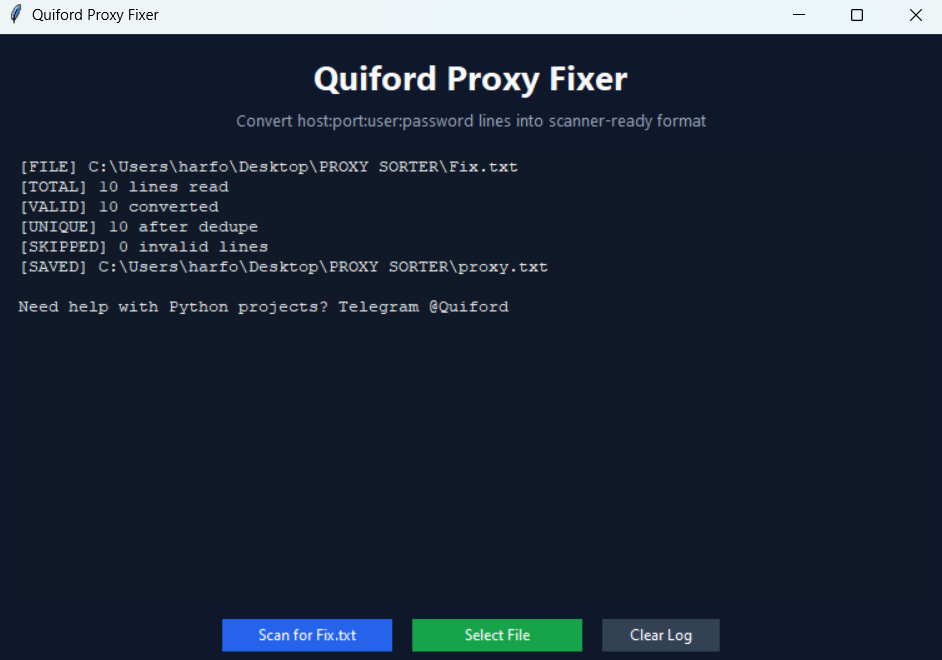
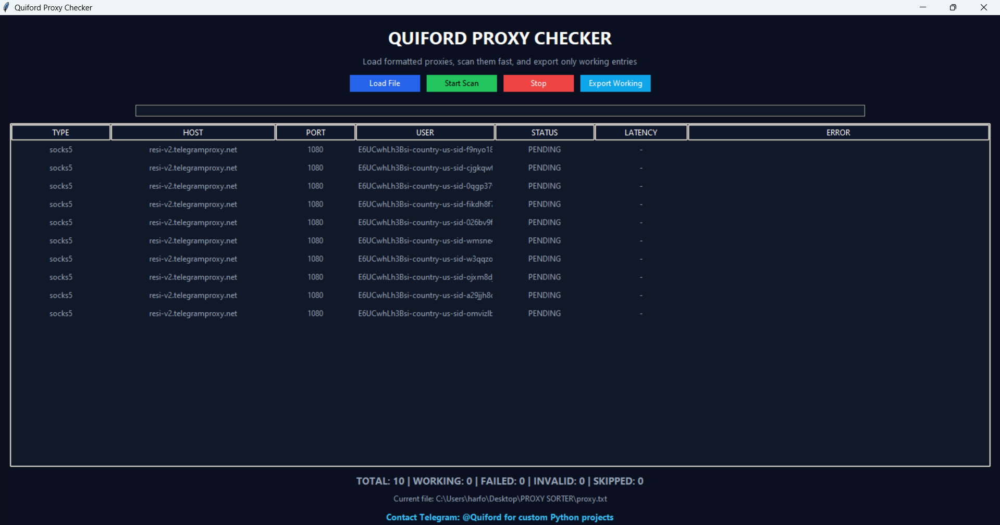
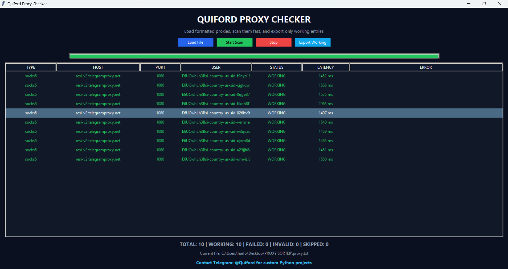

# Quiford Proxy Sorter

Quiford Proxy Sorter is a Python toolkit that helps you:

- Rearrange raw proxies into a standard format
- Validate and filter working proxies at high speed
- Use either GUI apps or CLI commands

If you want custom Python projects, contact me on Telegram: **[@Quiford](https://t.me/Quiford)**.

## Why this project

This is a beginner-friendly cybersecurity utility project focused on workflow automation and proxy list quality checks.  
It is designed to be simple to run, easy to extend, and clean enough for open-source collaboration.

# Screenshots

## Quiford Proxy Format Fixer



---

## Quiford Proxy Checker... Status: Unscanned



---

## Quiford Proxy Checker... Status: Completed



---


## Features

- Raw-to-formatted conversion (`host:port:user:password` -> `type,host,port,user,password`)
- Duplicate removal during conversion
- Concurrent proxy scanning for speed
- Result statuses: `WORKING`, `FAILED`, `INVALID`, `SKIPPED`
- Latency tracking in the GUI checker
- Export only working proxies in one click
- Clean CLI for automation and scripting

## Proxy formats

Raw input format (for fixer):

```txt
resi-v2.telegramproxy.net:1080:username:password
```

Formatted scanner format:

```txt
socks5,resi-v2.telegramproxy.net,1080,username,password
```

## Installation

1. Install Python 3.10+.
2. Install dependencies:

```bash
pip install -r requirements.txt
```

## Quick start

### GUI: Fix raw list

```bash
python proxy_fixer_gui.py
```

### GUI: Check proxies

```bash
python test_proxy.py
```

### CLI: Convert raw list

```bash
python proxysorter_cli.py fix --input Fix.txt --output proxy.txt --dedupe
```

### CLI: Check formatted list

```bash
python proxysorter_cli.py check --input proxy.txt --output working_proxy.txt --workers 120
```

## CLI commands

Fix command:

```bash
python proxysorter_cli.py fix --help
```

Check command:

```bash
python proxysorter_cli.py check --help
```

## Project Structure

```text
proxysorter/
├── checker.py
├── io_utils.py
├── models.py
├── parser.py
│
├── screenshots/
│   ├── quiford-proxy-checker-completed.png
│   ├── quiford-proxy-checker-unscanned.png
│   └── quiford-proxy-format-fixer.png
│
├── proxy_fixer_gui.py
├── test_proxy.py
├── proxysorter_cli.py
├── tests/
└── docs/
```

## Community files

This repo includes:

- `LICENSE` (MIT)
- `CONTRIBUTING.md`
- `SECURITY.md`
- `CODE_OF_CONDUCT.md`
- `CHANGELOG.md`
- CI workflow (`.github/workflows/ci.yml`)
- Issue + PR templates (`.github/`)

## Security and ethics

Use this tool only for legal and authorized testing.  
Do not use it for unauthorized access, abuse, or attacks.

## Support and contact

- Telegram: **[@Quiford](https://t.me/Quiford)**
- Open an issue for bugs or feature requests

## How to support this project

1. Star the repository
2. Fork and improve it
3. Open pull requests with tests
4. Share it with other Python/cybersecurity learners

## Roadmap

- Add rotating target checks
- Add optional async engine
- Add JSON/CSV export formats
- Add proxy source plug-ins
- Add optional API wrapper

## License

MIT License. See [LICENSE](LICENSE).
